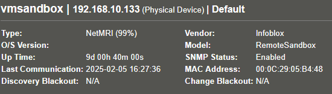

# NetMRI Sandbox SNMP Configuration

The default `/etc/snmp/snmpd.conf` in the NetMRI 7.6.0 Sandbox is set to:
* Listen on all interfaces
* Enable the same default v2c community as NetMRI, `per1sc0pe`
* Sets up a `netmri` user for v3, but does not specify passphrase or security

```perl
sysObjectID 1.3.6.1.4.1.24198.1.1.20
sysLocation vmsandbox
sysContact      Infoblox <netmri-support@infoblox.com>
sysServices     72
sysDescr        Infoblox NetMRI Sandbox
sysName vmsandbox

master  agentx

agentaddress  0.0.0.0,[::]

#sec        name                source          community
com2sec     netmri              default         per1sc0pe
com2sec6        netmri          default         per1sc0pe

#groupName      securityModel                   securityName
group           netmri                  v1              netmri
group           netmri                  v2c             netmri
group           netmri                  usm             netmri

#name   incl/excl       subtree         mask(optional)
view    all             included        .1

#group  context sec.model       sec.level       prefix  read    write   notif
access  netmri  ""      v1              noauth          exact   all     none    none
access  netmri  ""      v2c             noauth          exact   all     none    none
access  netmri  ""      usm             noauth          exact   all     none    none

rwuser netmri
```

## sysObjectID

The default sysObjectID, `1.3.6.1.4.1.24198.1.1.20`, while under
`NETCORDIA-MIB::netmriModels` doesn't actually match an object in `NETCORDIA-MI`B.
At least not in the 201910240000Z version.

The model OIDs under `netmriModels` do, however, include one for "RemoteSandbox". 

```asn.1
netmriModels OBJECT-IDENTITY
        STATUS  current
        DESCRIPTION
                "netmriModels is the root object identifier from
                which sysObjectID values are assigned."
        ::= { netmri 1 }

        Campus          OBJECT IDENTIFIER ::= { netmriModels 1 }
        Enterprise      OBJECT IDENTIFIER ::= { netmriModels 2 }
        OpsCenter       OBJECT IDENTIFIER ::= { netmriModels 3 }
        EC1000          OBJECT IDENTIFIER ::= { netmriModels 4 }
        EC2000          OBJECT IDENTIFIER ::= { netmriModels 5 }
        Live            OBJECT IDENTIFIER ::= { netmriModels 6 }
        SmallEnterprise OBJECT IDENTIFIER ::= { netmriModels 7 }
        LargeEnterprise OBJECT IDENTIFIER ::= { netmriModels 8 }
        RemoteSandbox   OBJECT IDENTIFIER ::= { netmriModels 9 }
        Automation4000 OBJECT IDENTIFIER ::= { netmriModels 10 }
        NT1400          OBJECT IDENTIFIER ::= { netmriModels 11 }
        NT2200          OBJECT IDENTIFIER ::= { netmriModels 12 }
        NT4000          OBJECT IDENTIFIER ::= { netmriModels 13 }
```

The most correct sysObjectID for the Sandbox _should_ be `1.3.6.1.4.1.24198.1.1.9`.

`.iso.org.dod.internet.private.enterprises.netcordia.netmri.netmriModels.RemoteSandbox`,
aka `NETCORDIA-MIB::RemoteSandbox`

This can be done with a very simple change to the first line of `snmpd.conf`.

```perl
#sysObjectID 1.3.6.1.4.1.24198.1.1.20
# NETCORDIA-MIB::RemoteSandbox
sysObjectID 1.3.6.1.4.1.24198.1.1.9
```

Restart snmpd to activate the change
```
$ sudo systemctl restart snmpd

$ systemctl status snmpd
● snmpd.service - Simple Network Management Protocol (SNMP) Daemon.
     Loaded: loaded (/lib/systemd/system/snmpd.service; enabled; vendor preset: enabled)
     Active: active (running) since Wed 2025-02-05 17:08:44 EST; 1s ago
   Main PID: 1677963 (snmpd)
      Tasks: 1 (limit: 2245)
     Memory: 2.6M
     CGroup: /system.slice/snmpd.service
             └─1677963 /usr/sbin/snmpd -LOw -u Debian-snmp -g Debian-snmp -I -smux mteTrigger mteTriggerConf -f

$ snmpget -On -v2c -c per1sc0pe ::1 1.3.6.1.2.1.1.2.0
.1.3.6.1.2.1.1.2.0 = OID: .1.3.6.1.4.1.24198.1.1.9
```

NetMRI will correctly decode the new OID and set sysModel accordingly.



