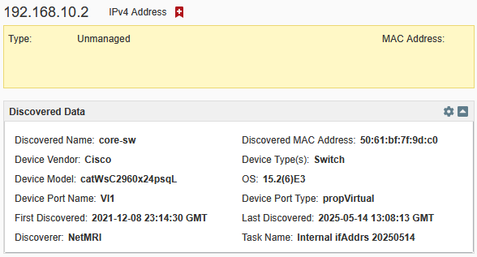

# Using SetDiscoveryCSV FileOp in with NIOS WAPI

The mechanism that NetMRI and Network Insight use to populate the "discovery 
data" attributes of an `ipv4address` or `ipv6address` (without a Record object)
is just a particular `fileop` WAPI call with a specially-formatted CSV.

Sounds easy on the surface, but diffcult to build a real workflow around.

Highly suggested to read [Hacking Infoblox Discovery for Fun and Profit](https://blogs.infoblox.com/community/hacking-infoblox-discovery-for-fun-and-profit-its-just-another-csv/) ([or here](https://www.dvolve.net/blog/2020/09/hacking-infoblox-discovery-for-fun-and-profit/)) before continuing.

Set by NetMRI's built-in IPAM Sync:


Possible with customized CSV:




## NIOS Requirements

The `fileop?_function=setdiscoverycsv` function should be present in WAPI v2.9
(NIOS 8.3.0) or later. Earliest tested has been v2.11, corresponding to NIOS
8.5.0.

WAPI v2.11.1 (NIOS 8.5.1) is required for `fileop?_function=get_log_files` to
support "DISCOVERY_CSV_ERRLOG" as a valid value for the "log_type" parameter.

NIOS 9.0.6 is current at time of writing and 8.6.x has eached EoL.


## IP Address CSV Format

Various Infoblox documents make mention of Discovery Data fields:
* [Synchronizing Between NetMRI and NIOS Appliances](https://infoblox-docs.refined.site/space/netmri760/357435322/Synchronizing+Between+NetMRI+and+NIOS+Appliances)
* [About Automatic Conversion Rules](https://docs.infoblox.com/space/nios90/280764047/About+Automatic+Conversion+Rules)
* [Variables for Object Change Discovery Data](https://docs.infoblox.com/space/nios90/1375045306/Variables+for+Object+Change+Discovery+Data)
* [discovery_data struct](https://ipam.illinois.edu/wapidoc/additional/structs.html#struct-discoverydata)
* [ipv4dress search-only fields](https://ipam.illinois.edu/wapidoc/objects/ipv4address.html#search-only-fields-list)
* [ipv6address search-only fields](https://ipam.illinois.edu/wapidoc/objects/ipv6address.html#search-only-fields-list)

### Columns

NetMRI's IPAM Sync uses at least these columns:
- ip_address
- ap_ip_address
- ap_name
- ap_ssid
- bgp_as
- bridge_domain
- device_contact
- device_location
- device_model
- device_vendor
- discovered_name
- discoverer
- endpoint_groups
- first_discovered_timestamp
- last_discovered_timestamp
- mac_address
- netbios_name
- network_component_contact
- network_component_description
- network_component_ip
- network_component_location
- network_component_model
- network_component_name
- network_component_port_description
- network_component_port_name
- network_component_port_number
- network_component_type
- network_component_vendor
- os
- port_duplex
- port_link_status
- port_speed
- port_status
- port_vlan_name
- port_vlan_number
- tenant
- vrf_description
- vrf_name
- vrf_rd
- task_name

Other verified column names:
- device_port_name
- device_port_type
- device_type

Known non-working column names:
- mgmt_ip_address
  - discovery_gm_sorter will log this as an unknown field name in the header
    and ignore the column, at least in NIOS 9.0.6. Older versions not tried.
- last_updated_timestamp
  - discovery_gm_sorter will log this as an unknown field name in the header
    and ignore the column, at least in NIOS 9.0.6. Older versions not tried.

### Confirmed-Working Custom Headers

ip_address,device_model,device_vendor,discovered_name,discoverer,first_discovered_timestamp,last_discovered_timestamp,mac_address,os,device_type,device_port_name,device_port_type,task_name

or as short as:

ip_address,discoverer,last_discovered_timestamp,task_name

### Task Name

`task_name` is unexpectedly important as it controls the scope for which existing
data will be replaced or _removed_.

**IMPORTANT**: _All_ existing discovery/unmanaged data with a Task Name that
matches the incoming CSV's Task Name will be removed, **even if in a different
Network View**. That is why NetMRI's IPAM Sync Task Names are "{OC IP}_1",
"{OC IP}_2", etc., so each sync job doesn't wipe out another's data.

The "merge"" parameter on the `fileop?_function=setdiscoverycsv` WAPI call only
prevents existing data removal for IP addresses _that are in the incoming CSV_.
If an IP address's discovery data was previously populated with the same Task
Name, but is not in the incoming CSV, _it will be removed_ regardless of
"merge" parameter in the WAPI call.

Recommeded tokens in the Task Name, to ensure uniqueness between Network Views,
data/job types (ex: if interface IPs and ARP entries are imported separately),
and persisting historic last-seen data, are "{Network View} {Data Type} {Date}".

Example: "Default ifAddrs 20250514"

An additional token for discovery engine may be necessary if multiple engines
are populating the same NIOS Grid.

### Date Format
`first_discovered_timestamp` & `last_discovered_timestamp` are formatted
YYYY-MM-DD HH:MM:SS without timezone (`%Y-%m-%d %H:%M:%S` for strftime/strftime)
and assumed to be UTC/GMT/Zulu (based on web UI representation). Including a
UTC offset (ie, "-04:00") will cause discovery_gm_sorter to skip the row.

It is unknown if milliseconds are supported.

Example: "2025-05-14 12:12:05"

`first_discovered` & `last_discovered` are seconds after the epoch. Import with
these fields has not been attempted as the "_timestamp" versions are easier to
manually investigate/verify in the CSV.

### MAC Address Format

Colon-delimited, **all lower-case**. Any uppercase characters will cause the row
to be skipped with discovery_gm_sorter logging "Invalid data format for column
'mac_address'"

- Valid: `00:1f:12:57:9c:c0`
- Invalid: `00:1F:12:57:9C:C0`

### IPv6 Address Format

Appears to be case-insensitive.


## Network CSV Format

TBD, additional research pending.

- [network fields](https://ipam.illinois.edu/wapidoc/objects/network.html#fields-list)
- [ipv6network fields](https://ipam.illinois.edu/wapidoc/objects/ipv6network.html#fields-list)

Network object "discovered_" fields seem to indicate that they have similar
fields, and `discovered_vlan_id` & `discovered_vlan_name` have been observed to
be populated by NetMRI's IPAM Sync, though `discovery_engine_type` remains "NONE"
in that instance.


## WAPI Calls

The NIOS GM is "nios.example.com", using WAPI v2.11.1, and has a Network View
called "Default Network View". The incoming CSV file is "import_file.csv".

The Content-Type header is assumed to be "application/json" unless specified.

The process is largely similar to a generic CSV-import job, but using a call to
fileop's "setdiscoverycsv" function rather than "csv_import" at the end.

### File Operation - Upload Init

The CSV file needs to be uploaded to the GM, so begin with an
[fileop uploadinit call](https://ipam.illinois.edu/wapidoc/objects/fileop.html#uploadinit):

The name of the CSV file being imported cannot contain spaces. The fileop call
will reject the uploadinit request.

`POST https://nios.example.com/wapi/v2.11.1/fileop?_function=uploadinit`

Postdata JSON payload:
```json
{"filename": "import_file.csv"}
```

This does not upload the file, but sets up NIOS for the upload. JSON will be
returned with the keys:

- `token` - Used for the "downloadcomplete" fileop call later
- `url` - Used for direct upload of CSV file

Example JSON returned:
```json
{
    "token": "eJylTk0LgjAY/iuxc26+c83qZlgQREXUeYhb9oI6mwuK6L/XiDp26fh8P3eCmkwHxJmzQh0dtqtN\nlkfxCCSMIE64EDyVnAwHxFw7dDflsTGvAKQiFQDjhFMhJCSTl+Pi6lB18r7rp4zBhFOQYwoxhQRY\noJVGZ0qvjlgbhZb9XmXYdNa93eGBLnyhGqvDPsmzfaZ288VXMG1pNbZVEGfL9YcPkPXeuqIyzDfd\nvz8eT0DUWsY=\n",
    "url": "https://192.168.10.131/http_direct_file_io/req_id-UPLOAD-0516151032442762/import_file"
}
```

Note the direct upload URL has the GM's IP address rather than FQDN and the
CSV file's extension is removed. That's how the file will be referred to in
logs later.

Python example:
```python
import json
import requests

post_data = {'filename': 'import_file.csv'}
response = requests.post(
    url='https://nios.example.com/wapi/v2.11.1/fileop?_function=uploadinit',
    headers={'Content-Type': 'application/json'},
    auth=('nios_username', 'nios_password'),
    data=json.dumps(post_data),
    verify=False,
    )
result = response.json()
token = result.get('token', '')
upload_url = result.get('url', '')
```

### Upload File

This is done as form-submission to the `url` value returned by uploadinit.

If a requests.Session() or other mechanism is used for holding session cookies,
that appears to not work for direct upload or download of files prepared by
fileop, and HTTP Auth is required for the call.

Python example:
```python
response = requests.post(
    url=upload_url,
    auth=('nios_username', 'nios_password'),
    files={
        'filedata': (
            'import_file.csv',
            open('/path/to/import_file.csv', 'rb'),
            ),
        },
    verify=False,
    )
```

This does not return anything but response.status_code of 200 will indicate
success.

### File Operation - Set Discovery CSV

Now that the CSV file is on the GM, a
[fileop setdiscoverycsv call](https://ipam.illinois.edu/wapidoc/objects/fileop.html#upload-setdiscoverycsv)
will begin the import:

`POST https://nios.example.com/wapi/v2.11.1/fileop?_function=setdiscoverycsv`

Postdata JSON payload with keys:
- `merge_data` - Boolean - The WAPI documentation is terse on this.
  * `true` (Default): Keeps fields on existing IPAM IP addresses that are not in
    the imported CSV, but whose IPs are. This **DOES NOT** prevent fields already
    set on an IP address by an import with the same Task Name from being erased if
    the IP address is not in the current import CSV.
    Example: if a previous run populated Device-level information and the
    current run is _only_ last-seen, this would keep the Device-level
    information intact.
  * `false`: Does keep not fields on existing IPAM IP addresses that are not in
    the imported CSV, but whose IPs are.
    Example: if a previous run populated Device-level information and the
    current run is _only_ last-seen, this would clear the Device-level
    information.
- `network_view` - String - NIOS Network View to which this import applies. Cannot be
  set per-record in the CSV.
- `token` - String - Token returned by uploadinit call

```json
{
  "merge_data": true,
  "network_view": "Default Network View",
  "token": "eJylTk0LgjAY/iuxc26+c83qZlgQREXUeYhb9oI6mwuK6L/XiDp26fh8P3eCmkwHxJmzQh0dtqtN\nlkfxCCSMIE64EDyVnAwHxFw7dDflsTGvAKQiFQDjhFMhJCSTl+Pi6lB18r7rp4zBhFOQYwoxhQRY\noJVGZ0qvjlgbhZb9XmXYdNa93eGBLnyhGqvDPsmzfaZ288VXMG1pNbZVEGfL9YcPkPXeuqIyzDfd\nvz8eT0DUWsY=\n"
}
```

Returned JSON if job submitted succesfully:
```json
{}
```

That's it. No status, not even an ID to reference the job later like a generic
CSV-Import. This is why searching logs is required later.

Failures that prevent the job from being accepted at all will return JSON with
keys:
- `Error` - More verbose message explaining the condition, and includes the
  error text
- `code` - Likely the module generating the error
- `text` - The succinct name of the error condition

Yes, capitalization is inconsistent for keys in fileop errors.

Observed types of failures that will prevent the job from starting and thus return JSON
are:

- Invalid Network View
```json
{ "Error": "AdmConDataError: None (IBDataError: IB.Data:Invalid network view 'NotRealView'.)",
  "code": "Client.Ibap.Data",
  "text": "Invalid network view 'NotRealView'."
}
```
- SetDiscoveryCSV job currently running
```json
{ "Error": "AdmConDataError: None (IBDataError: IB.Data:A discovery operation is currently running, can't import CSV file. Try again when the operation has completed)",
  "code": "Client.Ibap.Data",
  "text": "A discovery operation is currently running, can't import CSV file. Try again when the operation has completed"
}
```

Invalid merge_data or token parameters have not yet been tested.

Python example:
```python
post_data = {
    'merge_data':   True,
    'network_view': 'Default Network View',
    'token':        token,
    }
response = requests.post(
    url='https://nios.example.com/wapi/v2.11.1/fileop?_function=setdiscoverycsv',
    headers={'Content-Type': 'application/json'},
    auth=('nios_username', 'nios_password'),
    data=json.dumps(post_data),
    verify=False,
    )
result = response.json()
```


## Audit Log

While the call to begin the import doesn't return anything useful, status-wise,
entries in the Audit Log and Discovery CSV Error Log (yes, it has its own) can
be used to find events generated by `discovery_gm_sorter`.

Searching the Audit Log is largely optional, but can provide the most accurate
timestamp for finding when the GM considers the uploadinit and setdiscoverycsv
events to have occurred. These timestamps can be used to narrow the search in
the Discovery CSV Error Log to find the appropriate set of log messages.

### WAPI File Operation - Get Log Files

Similar to a CSV upload, there's a call to request log export which returns a
direct download link for a .tar.gz file, downloading said file, and a subsequent
download-complete call to notify the GM that the exported .tar.gz is safe to
remove.

Start with a call to the
[get_log_files fileop function](https://ipam.illinois.edu/wapidoc/objects/fileop.html#download-get-log-files)

`POST https://nios.example.com/wapi/v2.11.1/fileop?_function=get_log_files`

Postdata JSON payload with keys:
- `log_type` - String - "AUDITLOG", all-caps
- `node_type` - String - "ACTIVE". Potentially "ACTIVE" = GM, "BACKUP" = GMC?
- `include_rotated` - Boolean - False, no reason to fetch old log files for an
  even that just occurred

```json
{
  "log_type": "AUDITLOG",
  "node_type": "ACTIVE",
  "include_rotated": false
}
```

Returns JSON with `token` and `url` keys similar to uploadinit, but the URL is
used to download the log export tarball.

Example JSON returned:
```json
{
    "token": "eJytjssKwjAQRX9FstYk04et7ipVEERBBJchNLEOtKbGEXzgv9ssdOvG5X3M3PNkaNh0wLw9KzSj\ncrNfrzZFOZIpjCMZS5nJHFKI2XDA7K1Df1eEre1PIEuyJIa+wWWeJlnaN66+Cc+ORN1lKgRMIg7j\nnIPkEIMItjLobUXqgI1V6MSvXaGvBmnlak7a8/oROIwmrVpnAgUri12htvPFN7Cnyhk81SGcLdcf\nP0hxIed1bQW13X9oXm8l7F6u\n",
    "url": "https://192.168.10.131/http_direct_file_io/req_id-DOWNLOAD-0516203007081513/auditLog.tar.gz"
}
```

Python example:
```python
post_data = {
    'log_type':        'AUDITLOG',
    'node_type':       'ACTIVE',
    'include_rotated': False,
    }
response = requests.post(
    url='https://nios.example.com/wapi/v2.11.1/fileop?_function=get_log_files',
    headers={'Content-Type': 'application/json'},
    auth=('nios_username', 'nios_password'),
    data=json.dumps(post_data),
    verify=False,
    )
  result = response.json()
  token = result.get('token', '')
  download_url = result.get('url', '')
```

### WAPI File Download

Just a GET of the `url` value returned by get_log_files.

The Content-Type header _must_ be set to "application/force-download" or the GM
will reject the request.

If a requests.Session() or other mechanism is used for holding session cookies,
that appears to not work for direct upload or download of files prepared by
fileop, and HTTP Auth is required for the call.

Python example:
```python
import shutil

response = requests.get(
    url=download_url,
    stream=True,  # For binary download
    headers={'Content-Type': 'application/force-download'},
    auth=('nios_username', 'nios_password'),
    verify=False,
    )

with open('auditLog.tar.gz', 'wb') as tarball:
    shutil.copyfileobj(response.raw, tarball)
```

### WAPI File Operation - Download Complete

Letting the GM know that the download is complete will cause it to delete the
exported tarball and reclaim storage space. An attempt to get the previous
direct-download URL after making this call will return a 404.

Use the [downloadcomplete fileop function](https://ipam.illinois.edu/wapidoc/objects/fileop.html#downloadcomplete)

`POST https://nios.example.com/wapi/v2.11.1/fileop?_function=downloadcomplete`

Postdata JSON payload with keys:
- `token` - String - Token returned by get_log_files call

```json
{
  "token": "eJytjssKwjAQRX9FstYk04et7ipVEERBBJchNLEOtKbGEXzgv9ssdOvG5X3M3PNkaNh0wLw9KzSj\ncrNfrzZFOZIpjCMZS5nJHFKI2XDA7K1Df1eEre1PIEuyJIa+wWWeJlnaN66+Cc+ORN1lKgRMIg7j\nnIPkEIMItjLobUXqgI1V6MSvXaGvBmnlak7a8/oROIwmrVpnAgUri12htvPFN7Cnyhk81SGcLdcf\nP0hxIed1bQW13X9oXm8l7F6u\n"
}
```

Example JSON returned:
```json
{}
```

Python example:
```python
post_data = {'token': token}
requests.post(
    url='https://nios.example.com/wapi/v2.11.1/fileop?_function=downloadcomplete',
    headers={'Content-Type': 'application/json'},
    auth=('nios_username', 'nios_password'),
    data=json.dumps(post_data),
    verify=False,
    )
```

### Audit Log File

get_log_files returned auditLog.tar.gz, which contains 1 file - audit.log

Filtering by the username that made the WAPI call, the most recent
"DataUploadInit" call for the CSV filename without extension, followed by a
"SetDiscoveryCSV" call for the Network View used will give the time the GM
considers the SetDiscoveryCSV event to have started.

`datetime.fromisoformat()` in Python 3.9 doesn't support the suffix "Z" to
denote UTC/GMT/ZULU, but replacing the "Z" with "+00:00" is a sufficient
conversion.

Example log entries:
```
2025-05-16 20:17:58.108Z [nios_username]: Called - DataUploadInit: Args local_file="import_file"
2025-05-16 20:17:58.140Z [nios_username]: Login_Allowed - - to=AdminConnector ip=192.168.10.11 auth=LOCAL group=admin-group apparently_via=API
2025-05-16 20:17:58.197Z [nios_username]: Called - SetDiscoveryCSV: Args network_view="Default Network View",merge_data=True
```

Python tar handling example:
```python
import tarfile

if tarfile.is_tarfile('auditLog.tar.gz'):
    with tarfile.open('auditLog.tar.gz', mode='r:*') as tar:
        member = tar.getmember('audit.log')
        if member.isfile():
            binary = tar.extractfile(member).read()
            log_lines = binary.decode('utf8').splitlines()
```


## Discovery CSV Error Log

The Discovery CSV Error Log contains which columns and rows in the imported CSV
were ignored/skipped and why. Row numbering is not consistent within the log.

### WAPI File Operation - Get Log Files

Almost identical to getting the Audit Log, there's a call to request log export
which returns a direct download link for a .tar.gz file, downloading said file,
and a subsequent download-complete call to notify the GM that the exported
.tar.gz is safe to remove.

Start with a call to the
[get_log_files fileop function](https://ipam.illinois.edu/wapidoc/objects/fileop.html#download-get-log-files)

`POST https://nios.example.com/wapi/v2.11.1/fileop?_function=get_log_files`

Postdata JSON payload with keys:
- `log_type` - String - "DISCOVERY_CSV_ERRLOG", all-caps. Requires WAPI v2.11.1
  (NIOS 8.5.1) for this to be a valid paramter.
- `node_type` - String - "ACTIVE". Potentially "ACTIVE" = GM, "BACKUP" = GMC?
- `include_rotated` - Boolean - False, no reason to fetch old log files for an
  even that just occurred

```json
{
  "log_type": "DISCOVERY_CSV_ERRLOG",
  "node_type": "ACTIVE",
  "include_rotated": false
}
```

Returns JSON with `token` and `url` keys similar to uploadinit, but the URL is
used to download the log export tarball.

Example JSON returned:
```json
{
    "token": "eJytjssKwjAQRX9FstbEaZs+3FWrIIiCCC5DaWIdsKZOo/jAf9csdOvG5X3M3PNgqNmox8icFOpB\nsdouF6u8GAwlxAFAJNNMgoSU9XvMXFukm3LYmPcJJFEShWGcpTyTURIH78aZDv7Z3rm2GwkBWcAh\nTjkMOYQgvK00kqmc2uHBKLTi167Q2FX2Yug26S5TooWtuSuJ13dPpEtXqsZqz8OKfJOr9XT2Dcyx\nshqPtQ/H8+XH91J0zlJZG+Ga9t9czxe5Kmcs\n",
    "url": "https://192.168.10.131/http_direct_file_io/req_id-DOWNLOAD-0516211458951518/discoveryCsvErrLog.tar.gz"
}
```

Python example:
```python
post_data = {
    'log_type':        'DISCOVERY_CSV_ERRLOG',
    'node_type':       'ACTIVE',
    'include_rotated': False,
    }
response = requests.post(
    url='https://nios.example.com/wapi/v2.11.1/fileop?_function=get_log_files',
    headers={'Content-Type': 'application/json'},
    auth=('nios_username', 'nios_password'),
    data=json.dumps(post_data),
    verify=False,
    )
  result = response.json()
  token = result.get('token', '')
  download_url = result.get('url', '')
```

### WAPI File Download

Just a GET of the `url` value returned by get_log_files.

The Content-Type header _must_ be set to "application/force-download" or the GM
will reject the request.

If a requests.Session() or other mechanism is used for holding session cookies,
that appears to not work for direct upload or download of files prepared by
fileop, and HTTP Auth is required for the call.

Python example:
```python
import shutil

response = requests.get(
    url=download_url,
    stream=True,  # For binary download
    headers={'Content-Type': 'application/force-download'},
    auth=('nios_username', 'nios_password'),
    verify=False,
    )

with open('discoveryCsvErrLog.tar.gz', 'wb') as tarball:
    shutil.copyfileobj(response.raw, tarball)
```

### WAPI File Operation - Download Complete

Letting the GM know that the download is complete will cause it to delete the
exported tarball and reclaim storage space. An attempt to get the previous
direct-download URL after making this call will return a 404.

Use the [downloadcomplete fileop function](https://ipam.illinois.edu/wapidoc/objects/fileop.html#downloadcomplete)

`POST https://nios.example.com/wapi/v2.11.1/fileop?_function=downloadcomplete`

Postdata JSON payload with keys:
- `token` - String - Token returned by get_log_files call

```json
{
  "token": "eJytjssKwjAQRX9FstbEaZs+3FWrIIiCCC5DaWIdsKZOo/jAf9csdOvG5X3M3PNgqNmox8icFOpB\nsdouF6u8GAwlxAFAJNNMgoSU9XvMXFukm3LYmPcJJFEShWGcpTyTURIH78aZDv7Z3rm2GwkBWcAh\nTjkMOYQgvK00kqmc2uHBKLTi167Q2FX2Yug26S5TooWtuSuJ13dPpEtXqsZqz8OKfJOr9XT2Dcyx\nshqPtQ/H8+XH91J0zlJZG+Ga9t9czxe5Kmcs\n"
}
```

Example JSON returned:
```json
{}
```

Python example:
```python
post_data = {'token': token}
requests.post(
    url='https://nios.example.com/wapi/v2.11.1/fileop?_function=downloadcomplete',
    headers={'Content-Type': 'application/json'},
    auth=('nios_username', 'nios_password'),
    data=json.dumps(post_data),
    verify=False,
    )
```

### WAPI Get Grid Timezone

Logs contained in discoveryCsvErrLog are timestamped with the Grid's local time,
_without timezone_ which can't be directly compared to the Audit Log which
specifically uses UTC (unless the Grid happens to be configured for that
timezone).

Luckily there's the [grid time_zone field](https://ipam.illinois.edu/wapidoc/objects/grid.html#time-zone)

`GET https://nios.example.com/wapi/v2.11.1/grid?_return_fields=time_zone`

A JSON array of objects will be returned, each with the keys:
- `_ref` - Standard NIOS WAPI object reference ID
- `time_zone` - The timezone _name_, not offset. There are ways to convert this.

Example returned JSON:
```json
[
    {
        "_ref": "grid/b25lLmNsdXN0ZXIkMA:Infoblox",
        "time_zone": "US/Eastern"
    }
]
```

Python example:
```python
from datetime import datetime
from zoneinfo import ZoneInfo

response = requests.get(
    url='https://nios.example.com/wapi/v2.11.1/grid?_return_fields=time_zone',
    headers={'Content-Type': 'application/json'},
    auth=('nios_username', 'nios_password'),
    verify=False,
    )
result = response.json()
tz_name = result[0].get('time_zone', '')
grid_tz = ZoneInfo(tz_name)

tz_unaware = datetime.strptime('2025/05/16 16:18:15', r'%Y/%m/%d %H:%M:%S')
tz_aware = tz_unaware.replace(tzinfo=grid_tz)
```

### Discovery CSV Error Log

discoveryCsvErrLog.tar.gz has an internal directory structure, with multiple
discovery_csv_error.log._nnnnnnnnnn_ files. Higher the suffix number, the more
recent the file. The number _may_ relate to an interal job ID, but there's
seemingly no way to correlate it with a SetDiscoveryCSV event.

```shell
$ tar --gzip --list --file discoveryCsvErrLog.tar.gz
tmp/discovery_csv_error_tarfiles/
tmp/discovery_csv_error_tarfiles/discovery_csv_error.log.1747333082
tmp/discovery_csv_error_tarfiles/discovery_csv_error.log.1747342838
tmp/discovery_csv_error_tarfiles/discovery_csv_error.log.1747342019
tmp/discovery_csv_error_tarfiles/discovery_csv_error.log.1747242915
tmp/discovery_csv_error_tarfiles/discovery_csv_error.log.1747243048
tmp/discovery_csv_error_tarfiles/discovery_csv_error.log.1747331502
```

Ideally, the highest-numbered log file will contain the log matching the
import CSV file's name and be more recent than the start events found in the
Audit Log (or more recent than the start time of a script doing this...)

The Discovery CSV Error Log may need to be exported multiple times until logs
matching import job parameters appear.

RegEx with named match groups for parsing:

`^\[(?P<timestamp>\d{4}\/\d{2}\/\d{2} \d{2}:\d{2}:\d{2})\.\d{3}\] \(\d+ \S+\) \w+\.c:\d+ (?P<function>\S+): Discovery CSV import \[(?P<filename>\S+)\]: (?P<message>.+)$`

Example Grid's local time is EDT (-04:00).

If no columns were ignored and no rows skipped, there's only 1 line:
```
[2025/05/16 16:18:15.783] (3204044 /infoblox/dns/bin/discovery_gm_sorter) discovery_gm_sorter.c:6311 gm_sorter_main(): Discovery CSV import [import_file]: Import ended with the following status: "ok", processed 1 row(s), skipped 0 row(s) of 4 column(s) each, ignored 0 column(s)
```

Ignored columns
```
[2025/05/09 15:30:42.494] (3313969 /infoblox/dns/bin/discovery_gm_sorter) discovery_gm_sorter.c:1185 __csv_field_callback(): Discovery CSV import [import_file]: Unknown field name "mgmt_ip_address" in header found, column will be ignored

[2025/05/15 16:41:38.992] (1736686 /infoblox/dns/bin/discovery_gm_sorter) discovery_gm_sorter.c:1185 __csv_field_callback(): Discovery CSV import [import_file]: Unknown field name "last_updated_timestamp" in header found, column will be ignored
```

Skipped rows - Invalid data format
- `__csv_field_callback()` messages do not count the header row and data rows
  start at 0 and have useful information
- `__csv_row_callback()` messages _do_ count the header row and data rows start
  at 1 but have less useful information
```
[2025/05/08 17:02:43.073] (1921435 /infoblox/dns/bin/discovery_gm_sorter) discovery_gm_sorter.c:1213 __csv_field_callback(): Discovery CSV import [import_file]: Invalid data format for column 'mac_address' with value '00:1F:12:57:9C:C0' at line 0, skipping row
[2025/05/08 17:02:43.073] (1921435 /infoblox/dns/bin/discovery_gm_sorter) discovery_gm_sorter.c:1267 __csv_row_callback(): Discovery CSV import [import_file]: Skipped line #1 in CSV file

[2025/04/11 15:45:37.512] (24207 /infoblox/dns/bin/discovery_gm_sorter) discovery_gm_sorter.c:1213 __csv_field_callback(): Discovery CSV import [import_file]: Invalid data format for required column 'ip_address' with value '' at line 0, skipping row
[2025/04/11 15:45:37.512] (24207 /infoblox/dns/bin/discovery_gm_sorter) discovery_gm_sorter.c:1267 __csv_row_callback(): Discovery CSV import [import_file]: Skipped line #1 in CSV file
```

Skipped rows - No network was found
- `__csv_row_callback()` messages _do_ count the header row and data rows start
  at 1 and _do_ have useful information, unlike their invalid-format counterparts
```
[2025/05/14 12:17:59.932] (2158418 /infoblox/dns/bin/discovery_gm_sorter) discovery_gm_sorter.c:1285 __csv_row_callback(): Discovery CSV import [import_file]: No network was found for IP address 172.31.98.1, line 2 in CSV file. Row was not imported.
```

Python tar handling example:
```python
if tarfile.is_tarfile('discoveryCsvErrLog.tar.gz'):
    with tarfile.open('discoveryCsvErrLog.tar.gz', mode='r:*') as tar:
        # Highest numbered filename is most recent
        member_name = list(reversed(sorted(tar.getnames())))[0]:
        member = tar.getmember(member_name)
        if member.isfile():
            binary = tar.extractfile(member).read()
            log_lines = binary.decode('utf8').splitlines()
```

## Example Scripts

See [IPAM Host Sync from NetMRI Prototype](https://github.com/Empowered-Service-Delivery/t-mobile_ipam_host_test)
repo for example scripts for generating the CSV and importing with the WAPI.

Good luck!
